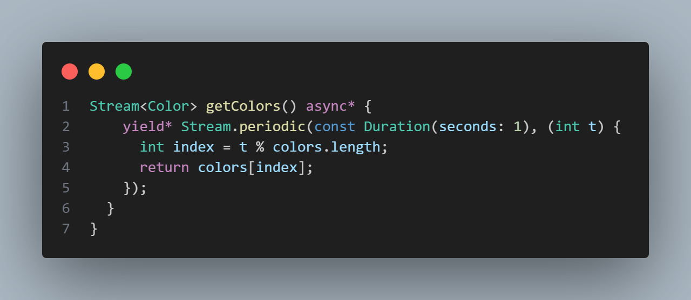
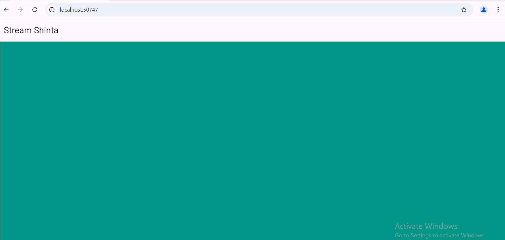

**Shinta Yulistiana_362358302076_2A TRPL**
==========================================
**Praktikum 1: Dart Streams**
==========================================
**Soal 1**
● Tambahkan nama panggilan Anda pada title app sebagai identitas hasil pekerjaan 
Anda.
● Gantilah warna tema aplikasi sesuai kesukaan Anda.
● Lakukan commit hasil jawaban Soal 1 dengan pesan “W13: Jawaban Soal 1”

**Soal 2**
● Tambahkan 5 warna lainnya sesuai keinginan Anda pada variabel colors tersebut.
● Lakukan commit hasil jawaban Soal 2 dengan pesan “W13: Jawaban Soal 2”

**Soal 3**
● Jelaskan fungsi keyword yield* pada kode tersebut!
Fungsi keywoard dalam kode tersebut digunakan untuk memberikan semua elemen dari sebuah variabel (seperti list, set, atau stream lain) ke dalam sebuah stream yang sedang dibangun.
● Apa maksud isi perintah kode tersebut?
Maksud isi perintah kode tersebut adalah untuk menghasilkan sebuah aliran (stream) warna secara bergantian setiap detik. Aliran warna diambil dari daftar warna yang telah ditentukan.
● Lakukan commit hasil jawaban Soal 3 dengan pesan “W13: Jawaban Soal 3”

**Soal 4**
● Capture hasil praktikum Anda berupa GIF dan lampirkan di README.

● Lakukan commit hasil jawaban Soal 4 dengan pesan “W13: Jawaban Soal 4”