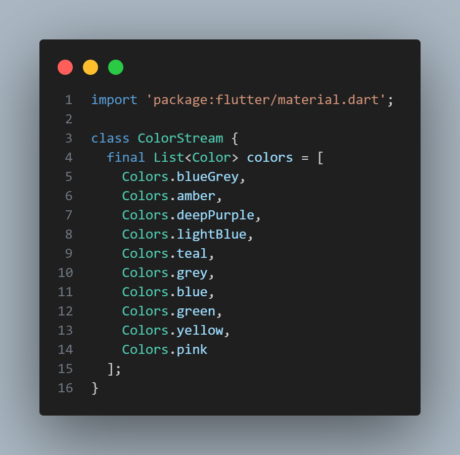

**Praktikum 1: Dart Streams**
**Langkah 2 Soal 1**
● Tambahkan nama panggilan Anda pada title app sebagai identitas hasil pekerjaan 
Anda.
● Gantilah warna tema aplikasi sesuai kesukaan Anda.
● Lakukan commit hasil jawaban Soal 1 dengan pesan “W13: Jawaban Soal 1”

**Langkah 3: Buat file baru stream.dart**

**Langkah 4: Tambah variabel colors Soal 2**
● Tambahkan 5 warna lainnya sesuai keinginan Anda pada variabel colors tersebut.
● Lakukan commit hasil jawaban Soal 2 dengan pesan “W13: Jawaban Soal 2”
